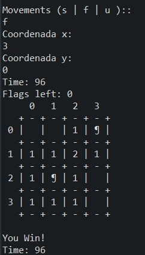

# MP-MinesWeeper

Aplicación desarrollada individualmente en 1º curso de grado de Ingenieria de software UniOvi.
Uno de los primeros proyectos JAVA con ui por consola. Desarrollado en Java con Eclipse.
#
## ¿Qué es?
Una versión del clásico buscaminas, con interfaz en consola de comandos.

<figure>
  
  <figcaption>Ventana de juego</figcaption>
</figure>

## Estado del proyecto
Cerrado

## Instalación
Proyecto simple de java, en Eclipse.

## Documentación
### Enunciados de la asignatura para realizar el proyecto (dividido en sprints):
- Sprint 1:https://github.com/Tora-U00F1-o/MP-MinesWeeper/blob/main/docs/minesweeper_1.pdf

- Sprint 2:https://github.com/Tora-U00F1-o/MP-MinesWeeper/blob/main/docs/minesweeper_2.pdf

- Sprint 3:https://github.com/Tora-U00F1-o/MP-MinesWeeper/blob/main/docs/minesweeper_3.pdf

- Sprint 4:https://github.com/Tora-U00F1-o/MP-MinesWeeper/blob/main/docs/minesweeper_4.pdf

- Sprint 5:https://github.com/Tora-U00F1-o/MP-MinesWeeper/blob/main/docs/minesweeper_5.pdf
